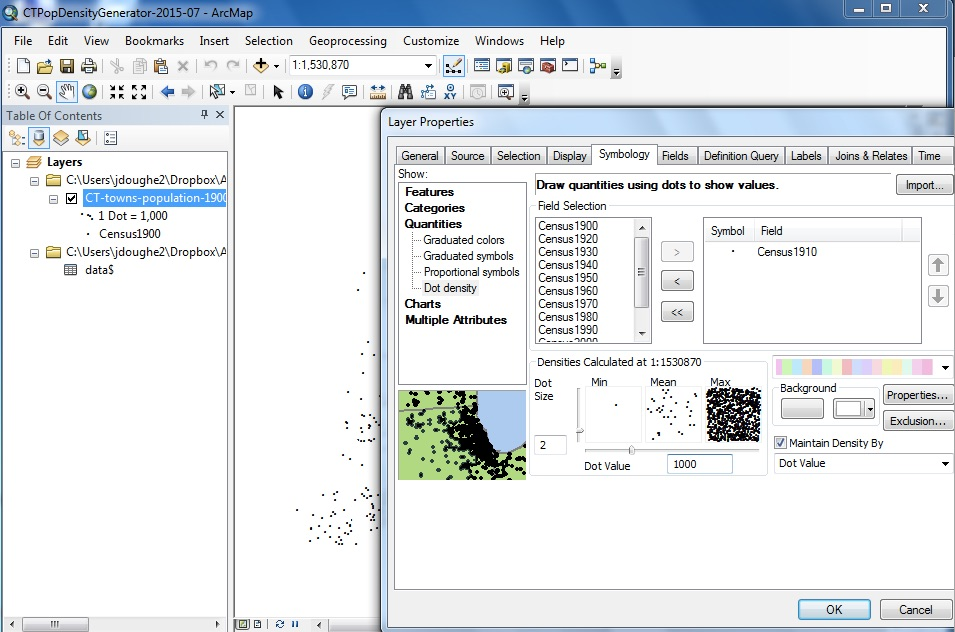

# otl-historical-dot-density
historical population dot density maps in Leaflet with time slider

## Link
http://jackdougherty.github.io/otl-historical-dot-density/index.html

## Shortcode to embed in http://OnTheLine.trincoll.edu
```
[iframe src="http://jackdougherty.github.io/otl-historical-dot-density" width="100%" height=600]
```

## Add caption
- Click replay button OR drag time slider.<br />1 dot = 1,000 people, randomly placed in towns<br /><em>Source: US Census summary, CT Secretary of State</em>

This replaces the animated GIF suburbanization map that I created around 2005 with ArcMap, where user cannot zoom in or stop player, with no overlays
- http://jackdougherty.github.io/otl-historical-dot-density/1900-2000-animated.gif

## To Do
- reorganize data into .csv and .geojson
- add hover with town name and population over time
- consider placing slider and button inside map, bottom-right
- consider adding overlays such as interstate highways, etc. to test ideas about where suburbanization happened

## Steps
1. Create TileLayer in ArcGIS and host on ArcGIS Online
2. Code Leaflet map with Esri-leaflet and rangeslider.js

### Create TileLayer in ArcGIS and host on ArcGIS Online

Based on documentation: Publish Tiles on ArcGIS Online https://doc.arcgis.com/en/arcgis-online/share-maps/publish-tiles.htm#GUID-C467C9D7-443D-48D6-90AB-8204E3B9FD83

Requires:
- ArcMap (I used v 10.2.2)
- ArcGIS Online organizational account access (I used http://trincoll.maps.arcgis.com/home/content.html)

Prepare historical population data (I used CT towns, 1900-2010 from CT Secretary of State, saved in XLS format, column headers cannot begin with numbers)

Download shapefile to match population data (I used CT town boundaries, 2010 census, WGS84 projection, downloaded from UConn MAGIC). Note that sourceinfo mentions two towns that do not perfectly match this boundary: West Haven not established until 1921, and Deep River has no data in this file until 1970

Follow documentation part 3: Build and publish a tile package, which seems to offer most control over size of tiles created. The goal is to create tile layers that are sufficiently detailed for your project, but with a small file size to allow rapid loading in your interactive map. (For the workflow below, each decade-level tile layer is about 2mb.)

Create map in ArcMap to join shapefile with population data table
- join town-level census data to statewide town shapefile
- layer > export > save data > create new shapefile to preserve the joined data
- properties > symbology > features: set town polygon to hollow
- properties > symbology > quantities > dot density: set up to generate each tile service the same way:
  - dot = black circle
  - dot size = 2
  - dot value = 1000
  - background line icon = no color (to remove town boundaries from tiles)
  - background fill icon = white (for solid statewide background when displayed on map)



Upload to ArcGIS Online
- file > log into ArcGIS online subscription account (in my case, http://trincoll.maps.arcgis.com)
- customize > arcmap options > sharing and select Enable ArcGIS Runtime tools
- file > share as > tile package, with these settings:
  - tile package > upload to my account (insert file name)
  - tile format: ArcGIS Online/Bing/Google, PNG, up to zoom level 11 (metro areas) since dots are randomly placed in each town
  - item description and tags (required)
  - sharing: everyone
- do this for each map layer (in my case, each decade of historical data)

In web browser, go to My Content for your ArcGIS Online site (mine is http://trincoll.maps.arcgis.com/home/content.html)
- individually click on each Tile Package that has been uploaded to open browser settings
- select Publish (ArcGIS Online will start "Publishing Tiles. . ."
- select Share > Everyone
- ArcGIS Online will create tiles with a URL similar to mine (http://tiles.arcgis.com/tiles/5rblLCKLgS4Td60j/arcgis/rest/services/CTPopDot1900/MapServer)
- WAIT ON THIS in My Content browser window, keep new "Tile Layer," but option to erase "Tile Package" to reduce storage charges for ArcGis Online

#### Notes to copy and paste when creating TileLayers
Item description summary, tags, access, credits to copy and paste each time:
- Connecticut town population dot density map, 1900-2010, based on US Census data reported by CT Secretary of State, for On The Line (http://OnTheLine.trincoll.edu)
- Connecticut
- CC-BY (freely available if attribution included)
- Jack Dougherty, Trinity College

## Code Leaflet map with Esri-leaflet and rangeslider.js
In Leaflet (with Esri-Leaflet plugin), code each tile layer to display as desired, based on this L.esriTiledMapLayer example
- http://esri.github.io/esri-leaflet/examples/tile-layer-1.html

Use rangeslider.js from https://github.com/andreruffert/rangeslider.js

## Credits
- Thanks to everyone who created esri-leaflet  
- Thanks @andreruffer for creating rangeslider.js, which I discovered through @alvinschang, and implemented with help from @erose
